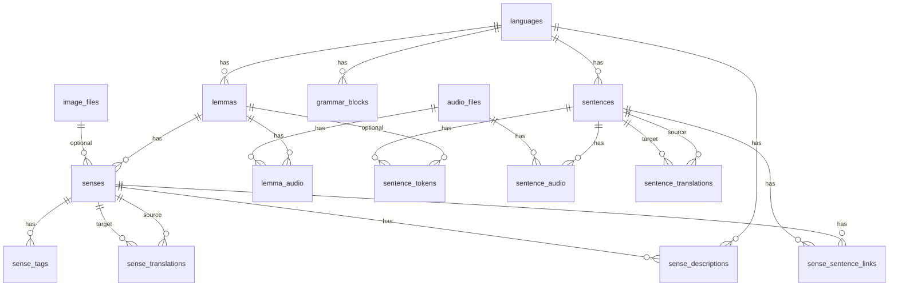

# Database Schema

Source of truth: [`backend/migrations/000001_init_schema.up.sql`](../backend/migrations/000001_init_schema.up.sql)

Single migration while pre-production — edit `000001` instead of adding new migrations.

## Overview



**15 tables** + trigger `trg_senses_updated_at` on `senses`.

## Core

### `languages`

| Column | Type | Notes |
|--------|------|-------|
| id | BIGSERIAL PK | |
| code | TEXT UNIQUE | `en`, `ru`, `es` |
| name | TEXT | |

### `lemmas`

| Column | Type | Notes |
|--------|------|-------|
| id | BIGSERIAL PK | |
| language_id | FK → languages | CASCADE |
| lemma | TEXT | |
| pos | TEXT | |
| frequency_rank | INTEGER | CHECK > 0 |
| frequency_count | INTEGER | CHECK ≥ 0 |
| ipa | TEXT | |
| source, source_ref | TEXT | |

Indexes: `language_id`, `lemma`, `(language_id, frequency_rank)`.

### `senses`

Main learnable unit for vocabulary (FSRS target per sense).

| Column | Type | Notes |
|--------|------|-------|
| id | BIGSERIAL PK | |
| lemma_id | FK → lemmas | CASCADE |
| sense_index | INTEGER | UNIQUE(lemma_id, sense_index) |
| cefr_level | TEXT | A1–C2 or NULL |
| image_id | FK → image_files | SET NULL |
| created_at, updated_at | TIMESTAMPTZ | auto-update on UPDATE |

### `grammar_blocks`

Teachable grammar topics for FSRS (one block = one curriculum card). Loaded from on-disk packages via `scripts/grammar/load_blocks.py`.

| Column | Type | Notes |
|--------|------|-------|
| id | BIGSERIAL PK | |
| language_id | FK → languages | CASCADE |
| slug | TEXT | UNIQUE per language, e.g. `a1-modality-can` |
| level | TEXT | A0–C2 |
| title | TEXT | display title |
| category | TEXT | curriculum folder: `verbs-tenses`, `modals`, … |
| super_category | TEXT | e.g. `MODALITY`, `PRESENT` |
| sub_category | TEXT | e.g. `can`, `present simple` |
| sort_order | INTEGER | order within level |
| metadata_json | JSONB | merged subs, detectability counts, source path |
| created_at | TIMESTAMPTZ | |

External EGP construct references live only in block files (`egp_links.yaml`), not in the database.

## Descriptions and tags

### `sense_descriptions`

Per-sense definitions in multiple languages.

| Column | Type |
|--------|------|
| sense_id | FK → senses |
| language_id | FK → languages |
| definition | TEXT |
| short_definition | TEXT |

UNIQUE(sense_id, language_id).

### `sense_tags`

Domain/vocabulary tags on senses (Kaikki etc.). Free-text `tag`.

UNIQUE(sense_id, tag).

### `sense_translations`

Links equivalent senses across languages.

| Column | Type |
|--------|------|
| source_sense_id, target_sense_id | FK → senses |
| relation_type | `exact` \| `close` \| `broader` \| `narrower` |
| confidence | NUMERIC(4,3) 0–1 |

PK(source_sense_id, target_sense_id).

## Sentences

### `sentences`

| Column | Type | Notes |
|--------|------|-------|
| id | BIGSERIAL PK | |
| language_id | FK → languages | |
| text | TEXT | |
| source, source_ref | TEXT | |
| level_id | TEXT | CEFR band (unconstrained) |

### `sentence_tokens`

NLP tokenization output (spaCy etc.).

| Column | Type |
|--------|------|
| sentence_id | FK → sentences |
| position | INTEGER |
| surface, lemma, pos, tag | TEXT |
| lemma_id | FK → lemmas (optional) |

UNIQUE(sentence_id, position).

### `sentence_translations`

Parallel sentences across languages. PK(source_sentence_id, target_sentence_id).

### `sense_sentence_links`

Word-sense disambiguation: which sense appears in which sentence.

| Column | Type | Notes |
|--------|------|-------|
| sense_id | FK → senses | |
| sentence_id | FK → sentences | |
| score | NUMERIC(4,3) | 0–1 |
| approved | BOOLEAN | default false |
| is_primary | BOOLEAN | default false |

UNIQUE(sense_id, sentence_id).

## Media

### `image_files`

`url`, `provider`, `metadata_json`, `source`, `source_ref`.

### `audio_files`

Same as images + optional `quality_score` (0–1).

### `lemma_audio` / `sentence_audio`

Junction tables: `(lemma_id|sentence_id, audio_id)` + `is_primary`.

## Data flows

### Vocabulary

```
languages → lemmas → senses → sense_descriptions
                      ↓
              sense_sentence_links ← sentences
```

### Grammar

```
blocks/{lang}/{level}/{slug}/   (source of truth on disk)
  block.yaml, egp_links.yaml, examples.json
              ↓ load_blocks.py
         grammar_blocks          (FSRS curriculum in DB)
              ↓
         review_items            (planned)
```

Example sentences from `examples.json` are imported into `sentences` separately for the example bank.

## Not in schema yet

From [`docs/design`](design) — planned for quiz/FSRS layer:

- `review_items` (FSRS cards for senses and grammar_blocks)
- `grammar_block_sentences` (link blocks to imported example sentences)
- `exercises`, `exercise_distractors`
- users, progress tables
